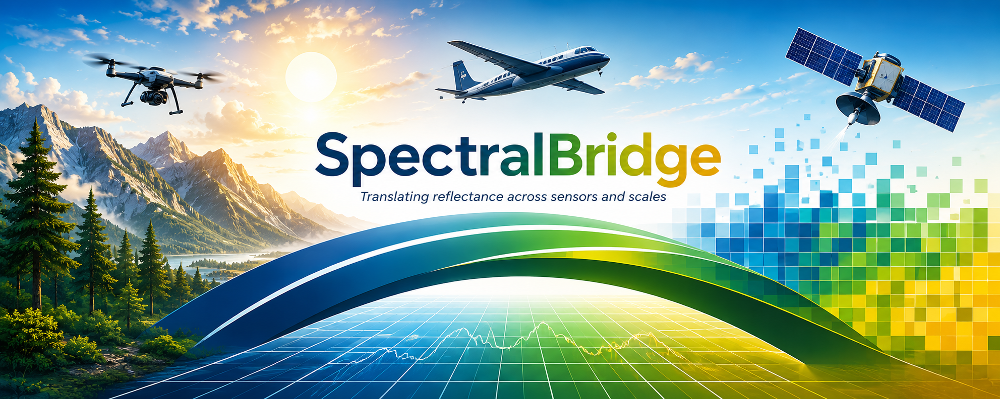

---
hide:
  - toc
---

  
  <section class="sb-hero">
    

      
    

    

      
Open scientific infrastructure for hyperspectral data

      <h1 id="spectralbridge">SpectralBridge</h1>
      
Connect drone, airborne, and satellite observations through a single reproducible workflow.

      
Process hyperspectral imagery across sensors, ecosystems, and scales using transparent, scalable, and scientifically defensible methods.

      

        <a class="sb-button sb-button--primary" href="quickstart/">Get Started</a>
        <a class="sb-button sb-button--secondary" href="reference/configuration/">Documentation</a>
        <a class="sb-button sb-button--secondary" href="tutorials/neon-to-envi/">Example Workflow</a>
      

    

  </section>

  <section class="sb-section">
    

      
What is SpectralBridge?

      <h2>What is SpectralBridge?</h2>
      
SpectralBridge is an open-source platform for transforming raw hyperspectral imagery into analysis-ready data products.

      
Whether you're working with drone surveys, airborne campaigns, ecological observatories, or future sensor systems, SpectralBridge provides a common framework for correction, harmonization, extraction, quality assurance, and analysis.

      
By creating consistent workflows across sensors and scales, SpectralBridge helps researchers focus on science rather than data wrangling.

    

  </section>

  <section class="sb-section">
    

      
Why SpectralBridge?

      <h2>Built for credible, repeatable environmental data science</h2>
    

    

      <article class="sb-card">
        <h3>Cross-Sensor Interoperability</h3>
        
Compare and integrate measurements collected by drones, aircraft, ecological observatories, and future sensor systems using a common analytical framework.

      </article>
      <article class="sb-card">
        <h3>Reproducible Science</h3>
        
Every processing step is transparent, documented, and designed to support repeatable scientific workflows.

      </article>
      <article class="sb-card">
        <h3>Scalable Infrastructure</h3>
        
Run locally, in containers, on cloud platforms, or on high-performance computing systems without changing your workflow.

      </article>
    

  </section>

  <section class="sb-section sb-section--workflow">
    

      
Workflow

      <h2>From Raw Data to Analysis-Ready Products</h2>
      
A transparent workflow for transforming hyperspectral imagery into scientifically defensible data products.

    

    

      
Raw Data

      
→

      
Quality Assessment

      
→

      
Correction &amp; Harmonization

      
→

      
Extraction &amp; Summarization

      
→

      
Analysis-Ready Products

    

    
SpectralBridge helps standardize hyperspectral processing while preserving transparency, reproducibility, and scientific traceability at every step.

  </section>

  <section class="sb-section">
    

      
Supported platforms

      <h2>Built for Environmental Observations Across Scales</h2>
    

    

      <article class="sb-card">
        <h3>Drone Systems</h3>
        
Process hyperspectral imagery collected from low-altitude drone platforms.

      </article>
      <article class="sb-card">
        <h3>Airborne Campaigns</h3>
        
Support regional airborne surveys and research aircraft missions.

      </article>
      <article class="sb-card">
        <h3>NEON Airborne Observation Platform</h3>
        
Work directly with NEON hyperspectral products using dedicated workflows.

      </article>
      <article class="sb-card">
        <h3>Future Sensors</h3>
        
Designed to support emerging environmental sensing technologies and evolving data standards.

      </article>
    

  </section>

  <section class="sb-section">
    

      
Scientific applications

      <h2>Scientific Applications</h2>
      
SpectralBridge supports a wide range of environmental monitoring and research applications.

    

    

      
Biodiversity Monitoring

      
Ecosystem Change Detection

      
Vegetation Functional Traits

      
Wildfire Science

      
Restoration Ecology

      
Carbon Dynamics

      
Remote Sensing Validation

      
Long-Term Ecological Monitoring

    

  </section>

  <section class="sb-section sb-section--open-science">
    

      
Open science

      <h2>Open Science by Design</h2>
      
SpectralBridge is built as open scientific infrastructure.

    

    

      Transparency
      Reproducibility
      Interoperability
      Scalability
      Community Contribution
    

    
All workflows are designed to support reproducible environmental data science and long-term scientific reuse.

    

      <a class="sb-button sb-button--secondary" href="https://github.com/earthlab/spectralbridge">View Source Code</a>
      <a class="sb-button sb-button--secondary" href="https://github.com/earthlab/spectralbridge/blob/main/CITATION.cff">Citation Information</a>
    

  </section>

  <section class="sb-section sb-cta">
    

      
Start here

      <h2>Build Once. Compare Everywhere.</h2>
      
SpectralBridge helps connect environmental observations across sensors, ecosystems, and scales through transparent and reproducible workflows.

    

    

      <a class="sb-button sb-button--primary" href="quickstart/">Get Started</a>
      <a class="sb-button sb-button--secondary" href="usage/notebook-example/">Explore Examples</a>
    

  </section>

